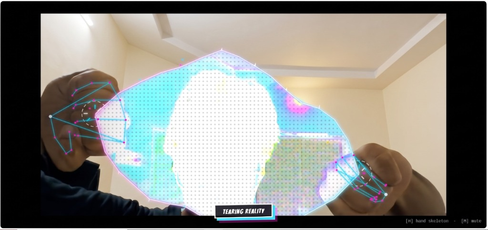

# TEAR — Dimensional Rift Webcam Effect

A real-time webcam effect that lets you rip a dimensional rift open with your
bare hands. Close both fists, touch them together, pull them apart, and watch
reality tear between them — with an inverted "other side," glitch bands,
chromatic edges, and a shockwave snap when you let go.

Built with MediaPipe hand tracking, the Canvas API, and WebAudio. All visuals
and audio are generated in code — no image or sound assets, no trademarked
characters, nothing to download beyond the tracking model on first run.



## ▶ Try it live

No download, no setup — just open this link, allow your camera, and start tearing:

**https://maxpain-sys.github.io/dimensional-rift-tear/public**

Runs over HTTPS so the webcam works instantly in Chrome or Edge.

## How it works

1. Click **ENTER THE RIFT** and allow camera access.
2. Step back so the camera sees both hands.
3. Close both fists and bring them together — a tension line appears while you
   grip the fabric of reality.
4. Pull your fists apart — the rift tears open as wide as you stretch.
5. Hold it wide and the interior settles into a calm window.
6. Let go — it slams shut with a flash and a shockwave.

### Controls

| Key | Action |
|-----|--------|
| `H` | Toggle hand-skeleton overlay |
| `M` | Mute / unmute audio |

## Install and run locally

Requires Node.js 16+ and a webcam. Chrome or Edge recommended (uses `ctx.filter`
on canvas, which is unreliable in Safari).

```bash
git clone https://github.com/maxpain-sys/dimensional-rift-tear.git
cd dimensional-rift-tear
node server.js
```

Your browser opens `http://localhost:3000` automatically. To skip auto-open,
run `NO_OPEN=1 node server.js`. To change the port, run `PORT=8080 node server.js`.

The app is fully static, so any static server works too:

```bash
python -m http.server -d public 3000
# or
npx serve public
```

## Features

- Real-time hand tracking with MediaPipe HandLandmarker (GPU with CPU fallback)
- Fist-grab gesture with hysteresis so the hold doesn't flicker
- A noise-driven jagged rift with glowing magenta-to-cyan edges and hot white cores
- An inverted other-side interior with hue cycling, glitch slices, RGB ghosts,
  and crawling ben-day dots
- Comic-book FX: debris shards, shockwave rings, white flash, screen shake,
  punch-zoom, film grain, and vignette
- Onomatopoeia bursts (`RIIIP!`, `SLAMM!`, `KRAKK!`) with chromatic display type
- Fully synthesized audio: reality-rumble while open, noise-sweep rips, bass snaps
- A cinematic letterbox that slides in while the rift is torn

## Project structure

```
dimensional-rift-tear/
├── server.js              zero-dependency static dev server
├── public/
│   ├── index.html         start screen + stage
│   ├── style.css          comic styling, letterbox, onomatopoeia
│   └── js/
│       ├── app.js         gesture state machine + main loop
│       ├── hands.js       MediaPipe hand tracking + fist detection
│       ├── tear.js        the dimensional rift renderer
│       ├── fx.js          shards, shockwaves, grain, vignette, word bursts
│       └── audio.js       synthesized rip / rumble / snap sounds
├── screenshots/           project screenshots
├── docs/                  mirror of public/ used for GitHub Pages
├── LICENSE                MIT
└── README.md
```

## Tech stack

| Layer | Tool |
|-------|------|
| Hand tracking | MediaPipe HandLandmarker, in-browser |
| Rendering | HTML5 Canvas 2D + `ctx.filter` |
| Audio | WebAudio API, fully synthesized |
| Server | Plain Node `http`, no dependencies |
| Font | Bangers (Google Fonts) |
| Loop | requestAnimationFrame |

## Originality and licensing

This is an original creative-coding project. Every visual and sound is
generated procedurally in the browser. It contains no trademarked character
likenesses, logos, or copyrighted assets, and is not affiliated with or
endorsed by any film studio. The rift aesthetic is an original homage to the
visual language of modern animated multiverse films.

Licensed under [MIT](LICENSE).

## Troubleshooting

| Symptom | Fix |
|---------|-----|
| Camera won't start | Use `http://localhost` or HTTPS. Chrome or Edge only. |
| Hand tracker hangs on load | First run fetches ~10 MB from a CDN. Check your connection and ad-blocker. |
| Tracking is jittery | Improve lighting, use a plainer background, keep fists in frame. |
| No audio | Click the page once first; check that `M` isn't muted. |
| Safari issues | Use Chrome or Edge — Safari's `ctx.filter` support is incomplete. |


## Repository topics

`webcam` `hand-tracking` `mediapipe` `canvas` `webaudio` `augmented-reality`
`motion-capture` `interactive` `visual-effects` `comic-book-style`
`multiverse` `dimensional-rift` `reality-tear` `spider-verse-inspired`
`superhero-aesthetic` `javascript` `creative-coding` `gesture-control`
