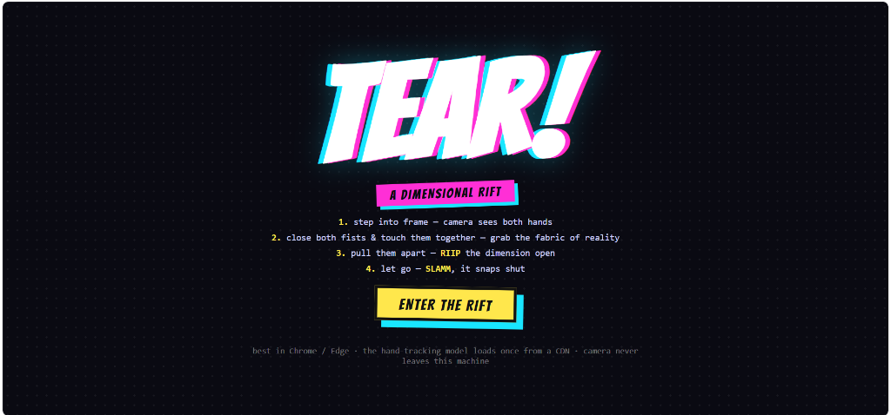

# 🌀 TEAR — Dimensional Rift Webcam Effect

> Rip reality open with your bare hands. A real-time, comic-book-styled
> webcam effect inspired by the multiverse-rift aesthetic of modern
> superhero animation — built with **MediaPipe hand tracking**, the
> **Canvas API**, and **WebAudio**. No game engine, no assets, no
> trademarked characters. 100% original procedural visuals + audio.

[](LICENSE)
[](https://developers.google.com/mediapipe)
[](#)

**Want to try it without installing anything?** Skip to the
[Live Demo](#-live-demo) section.

---

## ✨ Features

- ✋ **Real-time hand tracking** with MediaPipe (GPU + CPU fallback)
- ✊ **Fist-grab gesture** — close both fists, touch them, *rip* reality apart
- 🌌 **Animated dimensional rift** — jagged noise-driven edges, glowing
  magenta↔cyan color grading, hot white cores
- 🪞 **Inverted "other-side" interior** — hue-cycling, glitch slices,
  chromatic RGB ghosts, crawling ben-day print dots
- 💥 **Comic-book FX** — reality-debris shards, shockwave rings, white
  flash, screen shake + punch-zoom, film grain, vignette
- 🔤 **Onomatopoeia bursts** — `RIIIP!`, `SLAMM!`, `KRAKK!` with
  chromatic-offset display type (Bangers font)
- 🔊 **Fully synthesized audio** — reality-rumble while open, noise-sweep
  rips, thumpy bass snaps (no sound files)
- 🎬 **Cinematic letterbox** that slides in while the rift is torn
- 🖥️ **Hand-skeleton overlay** for visualizing the tracking (toggle with H)

---

## 🎮 How to Use

1. Open the app (local or [live demo](#-live-demo)) and click **ENTER THE RIFT**.
2. Allow camera access when prompted.
3. Step back so the camera sees **both hands**.
4. **Close both fists** and **touch them together** — a vibrating tension
   line appears (`grrrr…`). You're now gripping the fabric of reality.
5. **Pull your fists apart** — the rift tears open as wide as you stretch.
6. **Hold it wide** — the interior stabilizes into a calm window.
7. **Let go** — `SLAMM!` — it snaps shut with a flash and shockwave.

### Keyboard Controls

| Key | Action |
|-----|--------|
| `H` | Toggle hand-skeleton overlay |
| `M` | Mute / unmute audio |

---

## 📸 Screenshots

> The app uses your live webcam, so screenshots will reflect your own
> environment. Add your captures here — see [`screenshots/ADD_YOURS.md`](screenshots/ADD_YOURS.md)
> for tips.

<p align="center">
  &nbsp;&nbsp;
  
</p>
<p align="center">
  &nbsp;&nbsp;
  
</p>

> ⚠️ If the images above are broken, no screenshots have been added yet.
> Run the app and capture your own — see [`screenshots/ADD_YOURS.md`](screenshots/ADD_YOURS.md).

---

## 🚀 Install & Run (Local)

### Requirements

- **Node.js 16+** ([download](https://nodejs.org)) — only for the dev server.
  You don't need it if you just use the live demo.
- A modern browser: **Chrome or Edge recommended** (uses `ctx.filter` on
  canvas, which is unreliable in Safari).
- A webcam. Decent lighting and a fairly plain background help tracking.

### Steps

```bash
# 1. clone the repo
git clone https://github.com/maxpain-sys/dimensional-rift-tear.git
cd dimensional-rift-tear

# 2. run the server (no npm install needed — it's pure Node)
node server.js
```

Your browser opens `http://localhost:3000` automatically. Click
**ENTER THE RIFT**, allow the camera, and start tearing.

> 💡 To skip auto-opening the browser: `NO_OPEN=1 node server.js`
> 💡 To use a different port: `PORT=8080 node server.js`

### Alternative: any static server

The app is fully static — you can serve the `public/` folder with anything:

```bash
python -m http.server -d public 3000
# or
npx serve public
```

---

## 🌐 Live Demo

Once [GitHub Pages](#-deploy-to-github-pages-optional) is enabled, the app
will be live at:

### ➡️ **https://maxpain-sys.github.io/dimensional-rift-tear/**

> Replace `maxpain-sys` with your GitHub username and `dimensional-rift-tear`
> with your actual repo name. The first Pages build can take 1–2 minutes.

The live build is fully static — no Node required. Camera access works on
`github.io` because it's served over HTTPS.

---

## 📤 Upload to GitHub (Git CLI)

These commands push your local copy to a new GitHub repository. Do them once.

### Step 1 — Create the repo on GitHub

1. Go to https://github.com/new
2. **Repository name:** `dimensional-rift-tear` (or your choice)
3. Set to **Public** (required for free GitHub Pages)
4. **Do not** add README/license/.gitignore (we already have them)
5. Click **Create repository**

### Step 2 — Push your local code

Run these in the project folder (`C:\Users\BLACKMAN\spiderverse-tear`):

```bash
git init
git add .
git commit -m "Initial commit: TEAR dimensional rift webcam effect"
git branch -M main
git remote add origin https://github.com/maxpain-sys/dimensional-rift-tear.git
git push -u origin main
```

> Replace `maxpain-sys` with your GitHub username. You'll be prompted for
> credentials — use a [Personal Access Token](https://github.com/settings/tokens)
> as your password (GitHub no longer accepts account passwords for git HTTPS).

---

## 📡 Deploy to GitHub Pages (Optional but recommended)

GitHub Pages hosts the static `public/` folder for free. Use an **orphan
branch** so the Pages site only contains the app files (not `server.js`):

```bash
# create an empty orphan branch with only the public/ files
git checkout --orphan gh-pages
git rm -rf .          # remove everything from the index (files stay on disk)
git add public/*
git add public/.??*   # include dotfiles inside public/ if any
git commit -m "Deploy to GitHub Pages"
git push origin gh-pages

# switch back to main for future development
git checkout main
```

Then enable Pages:

1. Open your repo on GitHub → **Settings** → **Pages**
2. **Source:** `Deploy from a branch`
3. **Branch:** select `gh-pages` → `/ (root)` → **Save**
4. Wait 1–2 minutes for the build.

Your live URL appears at the top of that Pages settings page:
**`https://maxpain-sys.github.io/dimensional-rift-tear/`**

> 🔄 **To update the live site later:** after pushing changes to `main`,
> re-run the orphan-branch steps above to refresh `gh-pages`. For an
> automated workflow, add a [GitHub Action](https://github.com/marketplace/actions/deploy-to-github-pages)
> (out of scope here to keep this guide lean).

---

## 📁 Project Structure

```
dimensional-rift-tear/
├── server.js              zero-dependency static dev server
├── public/
│   ├── index.html         start screen + stage
│   ├── style.css          comic styling, letterbox, onomatopoeia
│   └── js/
│       ├── app.js         gesture state machine + main loop
│       ├── hands.js       MediaPipe hand tracking + fist detection
│       ├── tear.js        the dimensional rift renderer
│       ├── fx.js          shards, shockwaves, grain, vignette, word bursts
│       └── audio.js       synthesized rip / rumble / snap sounds
├── screenshots/           add your captures here
├── LICENSE                MIT
├── .gitignore
└── README.md
```

---

## 🧰 Tech Stack

| Layer | Tool |
|-------|------|
| Hand tracking | MediaPipe HandLandmarker (in-browser, GPU+CPU) |
| Rendering | HTML5 Canvas 2D + `ctx.filter` |
| Audio | WebAudio API (fully synthesized) |
| Server | Plain Node `http` (no deps) |
| Fonts | Bangers (Google Fonts) |
| Motion | requestAnimationFrame loop |

---

## 🎨 Inspiration & Originality

This project is an **original homage** to the rift/tear visual language
popularized by modern animated multiverse films. Every line of code, every
visual, and every sound is generated procedurally — **no trademarked
character likenesses, no copyrighted assets, no proprietary artwork** are
included. If you enjoyed the "rip a hole in reality" aesthetic of recent
superhero animation, this is a free, original take you can run on your own
webcam.

---

## ⚠️ Troubleshooting

| Symptom | Fix |
|---------|-----|
| Camera won't start | Use `http://localhost` or HTTPS (browsers block camera on plain HTTP IPs). Chrome/Edge only. |
| "Loading hand tracker…" hangs | First load fetches ~10MB from a CDN — needs internet. Check your connection/ad-blocker. |
| Tracking is jittery | Improve lighting, use a plainer background, keep fists in frame. |
| No audio | Click the page once (browsers require a user gesture before audio). Check `M` isn't muted. |
| Safari issues | Use Chrome/Edge — Safari's `ctx.filter` support is incomplete. |
| Phone on Wi-Fi | Needs HTTPS — see [Using a phone](#using-a-phone-on-the-same-wi-fi) below. |

### Using a phone on the same Wi-Fi

Browsers only grant camera access on `localhost` or HTTPS. To use a phone:
expose the server over HTTPS (e.g. `npx localtunnel --port 3000`) or add
your PC's `http://IP:3000` to Chrome's
`unsafely-treat-insecure-origin-as-secure` flag and restart the browser.

---

## 📜 License

[MIT](LICENSE) — free to use, modify, and share. Attribution appreciated but
not required.

---

<sub>Built as an original, trademark-free creative coding project. Not
affiliated with, endorsed by, or derived from any commercial film studio.
All visuals and audio are procedurally generated in your browser.</sub>

---

<details>
<summary>🔖 SEO keywords / GitHub topics (click to expand)</summary>

**Recommended GitHub repository topics** (Settings → … → Topics, max 20):

```
webcam  hand-tracking  mediapipe  canvas  webaudio
augmented-reality  motion-capture  real-time  interactive
visual-effects  comic-book-style  multiverse  dimensional-rift
reality-tear  spider-verse-inspired  superhero-aesthetic
javascript  creative-coding  gesture-control  ar
```

**Search terms this project relates to** (descriptive homage, no
trademarked names used as official tags): spider-verse inspired visual
effect, multiverse rift webcam, comic book animation style, superhero
aesthetic web app, reality tearing gesture, dimensional portal
hand-tracking, miles-morales-style aesthetic, gwen-stacy-style aesthetic,
across-the-spider-verse look, marvel multiverse vibe, hand-gesture webcam
effect, fist-rip reality tear.

These help fans of modern animated multiverse films discover this
original, trademark-free creative coding project.

</details>
